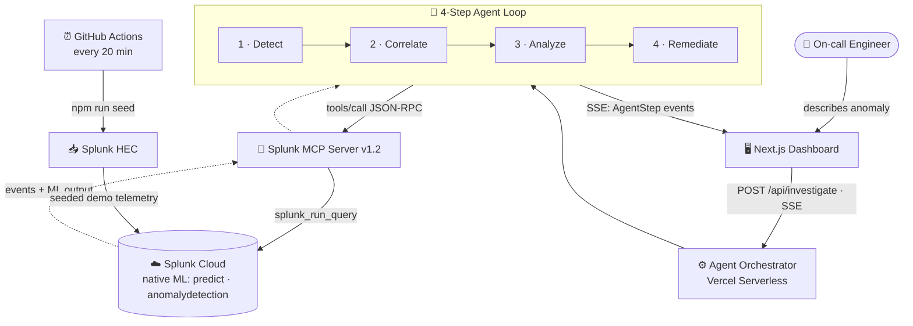
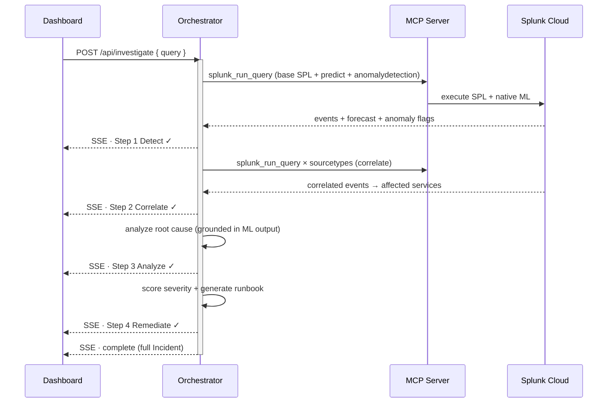

<div align="center">

# 🛰️ OpsWarRoom

### Agentic Incident Investigation, powered by Splunk AI

**OpsWarRoom turns a one-line alert into a full incident investigation — detect → correlate → analyze → remediate — driven by Splunk's native ML and streamed live to a dashboard.**

[](https://opswarroom.vercel.app)
[](./LICENSE)


*Built for the [Splunk Agentic Ops Hackathon 2026](https://splunk.devpost.com) · Track: **Observability***

</div>

---

## 📑 Table of Contents

- [The Problem](#-the-problem)
- [What OpsWarRoom Does](#-what-opswarroom-does)
- [How Splunk AI Is Used at Runtime](#-how-splunk-ai-is-used-at-runtime) ⭐
- [Architecture](#-architecture)
- [The 4-Step Agent Loop](#-the-4-step-agent-loop)
- [Tech Stack](#-tech-stack)
- [Getting Started](#-getting-started)
- [Keeping the Live Demo Fresh](#-keeping-the-live-demo-fresh)
- [API Reference](#-api-reference)
- [Splunk Tools Used](#-splunk-tools-used)
- [Sample Data Schema](#-sample-data-schema)
- [Project Structure](#-project-structure)
- [Known Limitations](#-known-limitations)
- [Roadmap](#-roadmap)
- [License](#-license)

---

## 🔥 The Problem

When a production incident fires at 3 AM, an on-call engineer has to do the same manual dance every time:

1. Open Splunk, write SPL to find the anomaly.
2. Pivot across metrics, logs, and network events to correlate the blast radius.
3. Reason about the root cause under pressure.
4. Improvise a remediation plan.

This is slow, error-prone, and depends on tribal knowledge. **OpsWarRoom automates the entire loop** as an AI agent that *uses Splunk's own ML at runtime* — and keeps a human in the loop for approval.

---

## ✨ What OpsWarRoom Does

| | Feature |
|---|---|
| 🤖 | **Autonomous 4-step agent loop** — Detect → Correlate → Analyze → Remediate |
| 🧠 | **Real Splunk ML at runtime** — `predict` + `anomalydetection` run *inside Splunk* via the MCP Server |
| 📡 | **Live streaming** — every agent step streams to the dashboard over Server-Sent Events (SSE) |
| 🔗 | **Cross-signal correlation** — joins metrics, application errors, and network events |
| 📋 | **Auto-generated runbook** — actionable remediation steps with ready-to-run SPL |
| ✅ | **Human-in-the-loop** — operator approves the runbook before action (approval is recorded) |
| 📊 | **Severity scoring** — incidents ranked S1–S5 from spike ratio, correlation, and duration |

---

## ⭐ How Splunk AI Is Used at Runtime

> This is the heart of the project. Detection is **not** based on hardcoded thresholds or simulated output — it calls Splunk's built-in machine-learning commands, executed **inside Splunk Cloud** through the **MCP Server's `splunk_run_query` tool**, on every investigation.

### `predict` — time-series forecasting *(primary signal)*

```spl
search index=main sourcetype=infra_metric earliest=-3h
| timechart span=5m avg(cpu_pct) as cpu_pct
| predict cpu_pct as predicted
```

Splunk's `predict` ML command forecasts the next-window CPU value with a 95% confidence interval. We contrast it against an ML-computed baseline to surface a clear signal, e.g.:

> *"Splunk predict (ML forecasting) projects cpu_pct at **96.7** — **2.1× the 45.3 baseline** (95% CI 71.2–122.2)."*

### `anomalydetection` — statistical outlier detection

```spl
search index=main sourcetype=infra_metric earliest=-3h
| anomalydetection cpu_pct mem_pct
```

Splunk's `anomalydetection` flags events that deviate from the learned distribution. It runs on every investigation and is reported when it flags outliers.

### Grounded analysis

The root-cause step is **grounded in the values these ML commands return** — affected hosts, peak metrics, and the forecast — so the narrative reflects real Splunk ML output, not a generic template.

> 💡 The exact SPL is surfaced live in the dashboard's **"🧠 Splunk Native ML"** panel, so reviewers can see the ML commands executing in real time.

<details>
<summary><b>Note on the Splunk AI Assistant & hosted models</b></summary>

<br>

OpsWarRoom also makes **best-effort calls** to the Splunk AI Assistant (`saia_generate_spl`, `saia_explain_spl`, `saia_ask_splunk_question`) and Splunk hosted GPT models. On the Splunk Cloud **trial tier** these backends are not provisioned (they return `Service not initialized` / are login-gated), so the runtime AI is delivered by Splunk's **native SPL ML commands** above. The hosted-model / AI-Assistant calls remain in the code and are used automatically if a provisioned instance is configured — graceful degradation by design.

</details>

---

## 🏗️ Architecture



A full data-flow diagram is in **[architecture_diagram.md](./architecture_diagram.md)**.

---

## 🔄 The 4-Step Agent Loop



| Step | What happens | Splunk usage |
|---|---|---|
| **1 · Detect** | Runs the search + the native ML pass (`predict`, `anomalydetection`); forecasts CPU vs. baseline and flags elevated readings | `splunk_run_query` |
| **2 · Correlate** | Joins `infra_metric`, `app_error`, `net_event` over the same window; derives affected services | `splunk_run_query` |
| **3 · Analyze** | Produces a root cause grounded in the ML findings (forecast, peak, hosts, correlation) | (best-effort hosted model / AI Assistant) |
| **4 · Remediate** | Scores severity S1–S5 and generates a 4–6 step runbook with SPL commands | (best-effort hosted model) |

---

## 🧰 Tech Stack

| Layer | Technology |
|---|---|
| **Frontend** | Next.js 15 (App Router), React 19, TypeScript, Tailwind CSS |
| **Streaming** | Server-Sent Events (SSE) — unidirectional, serverless-friendly |
| **Backend** | Next.js API routes on Vercel Serverless (Node 20), `maxDuration = 55s` |
| **Splunk** | Splunk Cloud Platform · MCP Server v1.2 (Splunkbase app 7931) · HEC for data |
| **MCP transport** | Direct HTTP JSON-RPC (`tools/call`) — no SDK dependency |
| **Validation** | Zod | 
| **Automation** | GitHub Actions (scheduled HEC seeding) |
| **Hosting** | Vercel |

---

## 🚀 Getting Started

### Prerequisites

- **Node.js 20+**
- A **Splunk Cloud Platform** account
- **Splunk MCP Server** app installed (Splunkbase app ID `7931`)
- A **HEC token** (Settings → Data Inputs → HTTP Event Collector) for seeding sample data

### 1. Clone & install

```bash
git clone https://github.com/Zenidp/opswarroom
cd opswarroom
npm install
```

### 2. Configure environment

```bash
cp .env.example .env.local
```

Fill in your Splunk credentials in `.env.local`:

```bash
SPLUNK_HOST=https://your-instance.splunkcloud.com
SPLUNK_TOKEN=                 # JWT token (Settings → Tokens)
SPLUNK_MCP_TOKEN=             # MCP encrypted token from the Splunk MCP Server app
SPLUNK_MCP_URL=https://your-instance.splunkcloud.com/en-US/splunkd/__raw/services/mcp
SPLUNK_HEC_URL=https://inputs.your-instance.splunkcloud.com:8088/services/collector
SPLUNK_HEC_TOKEN=             # HEC token
NEXT_PUBLIC_APP_URL=http://localhost:3000
```

### 3. Seed sample data

```bash
npm run seed
```

Creates a realistic **"CPU spike → app error cascade"** scenario (~150 events: a 3-hour
infrastructure-metric time series with a CPU spike, plus correlated application errors and
network events).

### 4. Run locally

```bash
npm run dev
```

Open **http://localhost:3000**, type an anomaly (e.g. `CPU spike on web-prod hosts causing app error cascade`), and hit **Trigger investigation**.

### 5. Deploy to Vercel

```bash
npx vercel --prod
```

Set the `SPLUNK_*` env vars in the Vercel dashboard (Project → Settings → Environment Variables).
Verify with `curl https://<your-app>.vercel.app/api/status` → `{"status":"ok","splunk":"connected"}`.

---

## ⏰ Keeping the Live Demo Fresh

OpsWarRoom detects **recent** incidents over time windows, so static demo data ages out. In
production this never happens — real telemetry streams in continuously. For the hosted demo, a
scheduled **GitHub Actions** workflow ([`.github/workflows/seed.yml`](./.github/workflows/seed.yml))
re-seeds every 20 minutes, simulating that live stream.

**To enable it:** add two repository secrets (Settings → Secrets and variables → Actions):

| Secret | Value |
|---|---|
| `SPLUNK_HEC_URL` | your HEC collector URL |
| `SPLUNK_HEC_TOKEN` | your HEC token |

You can also run it manually from the **Actions** tab, or just `npm run seed` locally before a demo.

---

## 📡 API Reference

| Endpoint | Method | Description |
|---|---|---|
| `/api/investigate` | `POST` | Trigger the agent loop. Returns an **SSE stream** of `AgentStep` events + a final `complete` event. |
| `/api/incidents` | `GET` | List recent investigations (server cache). |
| `/api/status` | `GET` | Splunk connection health check. |

### `POST /api/investigate`

```json
{
  "query": "CPU spike on web-prod hosts causing app error cascade",
  "context": "PagerDuty alert: api-gateway latency high"
}
```

**Response:** `text/event-stream` —

```
data: {"type":"step","payload":{"step":1,"label":"Detecting anomaly","status":"done","data":{...}}}
data: {"type":"step","payload":{"step":2,"label":"Correlating logs","status":"done",...}}
...
data: {"type":"complete","payload":{ /* full Incident object */ }}
```

---

## 🔌 Splunk Tools Used

| MCP Tool | Purpose |
|---|---|
| `splunk_run_query` | Execute SPL — including the `predict` & `anomalydetection` **ML commands** — for detect + correlate |
| `splunk_get_indexes` | Discover available indexes |
| `splunk_get_info` | Connection health check (`/api/status`) |
| `saia_generate_spl` · `saia_explain_spl` · `saia_ask_splunk_question` | Best-effort NL↔SPL via Splunk AI Assistant (not provisioned on trial → graceful fallback) |

**Native Splunk ML commands executed at runtime:** `predict` (forecasting), `anomalydetection` (outlier detection).

---

## 🗃️ Sample Data Schema

All data lives in `index=main` (the trial tier has no custom indexes) and is distinguished by `sourcetype`:

| Sourcetype | Description | Key fields |
|---|---|---|
| `infra_metric` | Infrastructure metrics (3h time series) | `cpu_pct`, `mem_pct`, `host`, `region`, `service` |
| `app_error` | Application error events | `service`, `error_code`, `severity`, `host`, `message` |
| `net_event` | Network events | `src_ip`, `dst_port`, `bytes`, `protocol`, `action` |

**Scenario:** a CPU spike on `web-prod-0{1,2,3}` cascades into timeouts across `api-gateway`,
`user-service`, `payment-service`, and `notification-service`.

---

## 📁 Project Structure

```
opswarroom/
├── src/
│   ├── app/
│   │   ├── page.tsx                     # Dashboard
│   │   ├── incidents/[id]/page.tsx      # Investigation detail (client, localStorage)
│   │   └── api/
│   │       ├── investigate/route.ts     # POST → agent loop, SSE stream
│   │       ├── incidents/route.ts       # GET → history
│   │       └── status/route.ts          # GET → Splunk health
│   ├── lib/
│   │   ├── agent/
│   │   │   ├── orchestrator.ts          # 4-step loop + SSE emit
│   │   │   └── steps/                    # detect · correlate · analyze · remediate
│   │   ├── splunk/
│   │   │   ├── mcp-client.ts            # Direct HTTP JSON-RPC to MCP Server
│   │   │   ├── ml.ts                    # ⭐ Splunk native ML (predict + anomalydetection)
│   │   │   ├── hec-client.ts            # HEC seeding client
│   │   │   └── hosted-models.ts         # Best-effort hosted model + grounded fallback
│   │   └── store/
│   │       ├── incidents.ts             # Server-side in-memory cache
│   │       └── clientIncidents.ts       # Browser store (serverless-safe persistence)
│   └── components/                       # dashboard · investigation · ui
├── scripts/seed-splunk.ts               # Seed Splunk via HEC
├── .github/workflows/seed.yml           # Scheduled auto-seed (every 20 min)
└── architecture_diagram.md
```

---

## ⚠️ Known Limitations

- **Incident history is browser-local** (localStorage). Vercel serverless is stateless across
  invocations, so the server keeps only a short-lived cache; production would use Postgres / Vercel KV.
- **Splunk AI Assistant & hosted GPT models are not provisioned** on the Splunk Cloud trial tier —
  runtime AI is delivered by native SPL ML (`predict`, `anomalydetection`).
- **Runbook approval is a UI gate** (human-in-the-loop) — it records approval but does not execute
  remediation. Splunk is an observability platform; execution would be delegated to Splunk SOAR or
  infrastructure APIs.
- **No authentication layer** — production would add Splunk RBAC passthrough.

---

## 🗺️ Roadmap

- [ ] **Query-driven detection** — route the investigation by signal type (metrics → `predict`/`anomalydetection`, errors → rate analysis on `app_error`, network → `net_event`) so the agent adapts to the described anomaly
- [ ] Persist incidents to Vercel KV / Postgres
- [ ] Splunk SOAR integration to actually execute approved runbooks
- [ ] Webhook ingestion (PagerDuty, Opsgenie) to auto-trigger investigations
- [ ] Slack notifications with runbook export
- [ ] Multi-incident timeline & blast-radius graph

---

## 📄 License

[MIT](./LICENSE) © 2026 OpsWarRoom

<div align="center">

---

**[🚀 Try the live demo →](https://opswarroom.vercel.app)**

*Made for the Splunk Agentic Ops Hackathon 2026*

</div>
